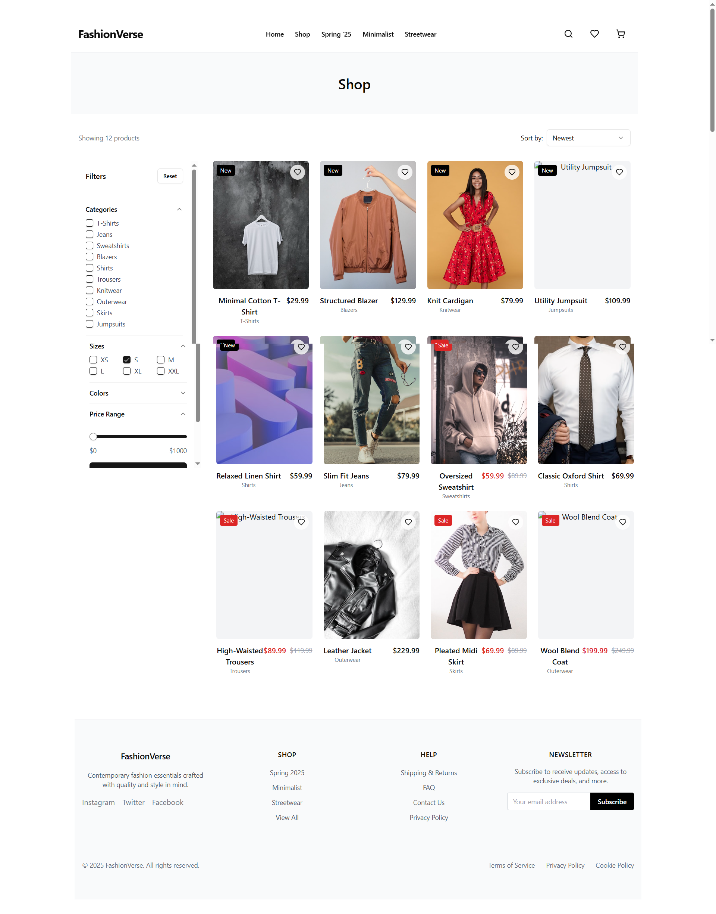

# 👗 FashionVerse

A modern, minimalist shopping experience built with **Vite + React + TypeScript**, styled using **Tailwind CSS** and **shadcn/ui**. FashionVerse offers a smooth and elegant interface for browsing fashion items, filtering by category, and enjoying a clean, responsive layout.

---

## ✨ Features

- 🛍️ Clean, minimalist storefront view
- 🧭 React Router-based navigation
- 🎨 Stylish UI using Tailwind CSS and shadcn/ui
- 🔍 Filters to refine product search
- 🧠 Modular code structure with custom hooks
- 📱 Fully responsive design
- ⚡ Fast performance using Vite

---

## 🎥 Demo

[

> 📽️ Click above to watch a short walkthrough of the app in action.

---

## 🖼️ Screenshots

---

## 🚀 Tech Stack

- **Frontend:** React + TypeScript
- **Styling:** Tailwind CSS + shadcn/ui
- **Routing:** React Router
- **Build Tool:** Vite

---

